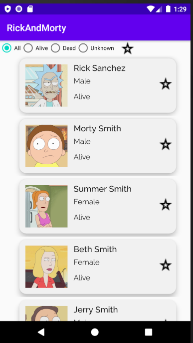
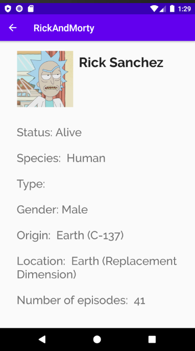

# Rick and Morty app
> App providing information about rick and morty

## Table of contents
* [General info](#general-info)
* [Screenshots](#screenshots)
* [Technologies](#technologies)
* [Setup](#setup)
* [Features](#features)
* [Status](#status)
* [Inspiration](#inspiration)

## General info
App providing information about rick and morty based on https://rickandmortyapi.com/

## Screenshots

## Technologies
* Kotlin 
* Room
* Retrofit
* coroutines
* Hilt
* DataStore
* Picasso 
* MVVM

## Setup

## Code Examples
Datastore example:
`fun getFavourites(): Flow<String> = dataStore.data.catch { exception ->
        if (exception is IOException) {
            emit(emptyPreferences())
        } else {
            throw exception
        }
    }.map { it[favList] ?: "[]" }`

## Features
List of features ready and TODOs for future development
* Splash Screen
* Fav list
* Character filtering by status 

To-do list:
* character filtering by episodes

## Status
Project is: _in progress_

## Inspiration
Project based on https://rickandmortyapi.com/ 
